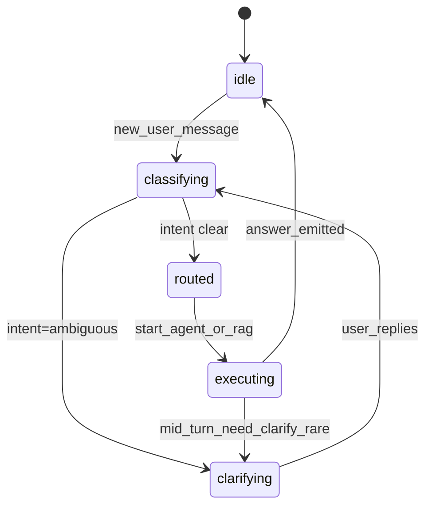
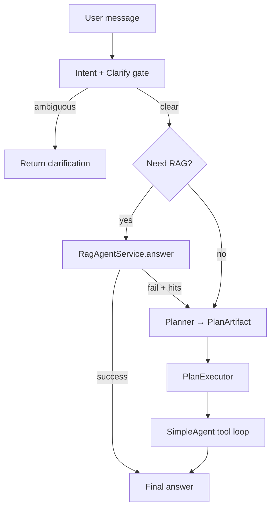

# Agent：任务理解与对话 + 规划与推理（实现设计）

本文在已存在的 Agent 文档基础上，补齐两块能力的**可落地设计**，供 Agent C 与 D 分阶段实现。前置阅读：

- [loop.md](loop.md)：工具循环状态机与 Prompt 分层
- [rag-bridge.md](rag-bridge.md)：RAG 与对话编排路由
- [mvp-scope.md](mvp-scope.md)：MVP 边界与不做清单
- 现状代码：`SessionStore`（最近 40 条 user/assistant）、`SimpleAgent`（JSON 工具循环，`max_steps` 默认 6）

---

## 0. 设计目标与原则

| 维度 | 现状 | 目标 |
|------|------|------|
| 任务理解 | 主要靠单轮模型自悟 | **显式意图** + **可选澄清** + **会话级任务状态**（可恢复、可观测） |
| 规划 | 隐式多步工具调用 | **显式计划结构**（可回放、可失败重规划），仍受 `max_steps` 与工具协议约束 |

**原则**

- 不替代 RAG/生成契约：`coordination.md` §3.9 / §3.14 主字段与拒答口径不变；本设计新增能力优先落在**编排层与可选持久化**，避免未批契约就改对外 JSON。
- 与 `agent_loop` 的关系：**对话状态机**与**工具循环**可视为正交两轴；编排器先跑「理解/澄清/路由」，再进入 `SimpleAgent.run` 或直出 RAG。

---

## 1. 任务理解与对话

### 1.1 概念模型

- **Turn（一轮用户发送）**：从用户发 `message` 到返回 `answer` 的一次 HTTP 请求周期。
- **SessionTaskState（会话任务态）**：跨多 Turn 保留的轻量结构，描述「当前在解决什么问题、缺什么信息、是否已澄清」。**不**要求塞进每条模型 prompt 全文；可摘要后注入。
- **Intent（意图）**：结构化标签 + 置信度，用于路由 RAG / 工具 / 直答 / 澄清。

建议 `Intent` 初版枚举（可扩展）：

| intent | 含义 | 典型路由 |
|--------|------|-----------|
| `knowledge_corpus` | 依赖已入库文档的事实/数字 | 先 RAG（见 rag-bridge） |
| `tool_only` | 仅时间/计算/读写 workspace 等 | 跳过 RAG，进工具循环 |
| `mixed` | 既要语料又要工具 | RAG（若需）→ 带证据进 Agent |
| `chitchat` | 与语料无关的闲聊/格式 | 直答，不要求引用 |
| `ambiguous` | 信息不足，需澄清 | **不**调用 RAG；返回澄清问句或选项 |
| `unsafe_or_refuse` | 策略拒答 | 固定话术，不调 RAG |

### 1.2 澄清（主动澄清）策略

**触发条件（规则优先，模型为辅）**

- 用户消息过短且无指代消解（如「这个呢？」但历史中无明确实体）。
- 多公司/多年份语料场景下，问题含「营业收入」但未出现公司名或年份（可配置为 `ambiguous`）。
- 财务锚点等 **结构化规则**（实现中已不设「置信度低于 τ 即澄清」的摆设分支；若后续接模型分类 JSON，再启用可校准的 τ）。

**行为**

- 返回 **一条** assistant 消息：列出 1～3 个澄清问题或选项（A/B/C），**不**消耗 `max_steps` 工具步。
- 将 `SessionTaskState.phase = awaiting_clarification`，并写入 `pending_questions[]`。
- 下一 Turn 用户回复后：`phase → active`，用补齐后的 **规范化 query** 再走 RAG/Agent。

**持久化**

- 方案 A（推荐 MVP）：`SessionStore` 旁路文件 `sessions_meta.json` 或 `session_id → JSON blob`，与 `sessions.json` 同目录；**不**混入 40 条对话截断逻辑。
- 方案 B：在 `sessions.json` 每条 session 增加可选字段 `meta`（需 D 改序列化与 §3.8 说明 → 须走 `coordination.md` §3.12）。

### 1.3 任务状态机（对话轴）

与 [loop.md](loop.md) 中的 **plan/tool/observe** 不同，本状态机描述 **用户目标在会话内的生命周期**。



- **executing**：内部再进入 `loop.md` 的 `plan → tool_call → observe → … → answer` 或「RAG 直出」。
- **mid_turn_need_clarify_rare**：可选；一般澄清放在 Turn 首，避免工具跑到一半再问用户（除非工具返回明确「缺参」）。

### 1.4 模块与数据形状（建议）

```text
src/agent/core/dialogue/
  intent_schema.py      # Intent, IntentResult(dataclass)
  intent_classifier.py  # classify(message, history_summary) -> IntentResult
  clarify_policy.py     # should_clarify(intent, message, session_meta) -> bool
  task_state.py         # SessionTaskState, transitions
```

**IntentResult（抽象字段）**

| 字段 | 类型 | 说明 |
|------|------|------|
| `intent` | enum | 上表之一 |
| `confidence` | float | 0～1 |
| `normalized_query` | str \| None | 供 RAG 用的规范化问题（含指代消解摘要） |
| `slots` | dict | 如 `company`, `year`, `metric`（可选，供过滤预留） |
| `clarify_prompt` | str \| None | 若需澄清，直接可用的中文问句 |

**实现策略（分阶段）**

1. **Phase 1**：规则 + 关键词（零额外模型调用）；`ambiguous` 仅规则触发。
2. **Phase 2**：单次小模型调用，输出 **严格 JSON** 的 `IntentResult`（与 [loop.md](loop.md) §4 工具 JSON 风格一致，但 endpoint 可为独立 `classify` prompt）。
3. **Phase 3**：与 B 对齐 `filters`（`coordination.md` / rag-bridge）后，把 `slots` 传入 `RagAgentService.answer`。

### 1.5 与 SessionStore 的衔接

- **历史消息**：仍只存 user/assistant，最近 40 条；**摘要**可周期性写入 `SessionTaskState.last_summary`（另一进程或同 Turn 首步调用小模型压缩）。
- **任务态**：存 `sessions_meta.json`，键为 `session_id`，避免被 40 条截断清掉。

---

## 2. 规划与推理

### 2.1 与 SimpleAgent 的差异

| 项 | SimpleAgent 现状 | 本设计增量 |
|----|------------------|------------|
| 计划 | 无显式结构，每步模型二选一：JSON 工具 or 自然语言终答 | 在工具循环**之前或第一步**产出 **PlanArtifact** |
| 可回放 | 仅有 `tool_calls: list[str]` | 增加 `plan_steps[]`（id、描述、状态、依赖） |
| 失败 | 工具失败字符串回灌，由模型自悟 | **显式 replan 计数** + 可选「撤销未完成步骤」标记 |

### 2.2 PlanArtifact（计划结构）

建议最小可落地结构：

```json
{
  "plan_id": "p_20250325_01",
  "goal": "用户目标一句话",
  "steps": [
    {
      "id": "s1",
      "action": "tool | rag | answer | noop",
      "detail": "read_workspace_file: path=...",
      "status": "pending | running | done | failed | skipped",
      "depends_on": []
    }
  ],
  "version": 1
}
```

- **action 与现有能力映射**
  - `tool`：对应现有 `{"tool","input"}` 调用。
  - `rag`：编排层直接调 `RagAgentService.answer`（不占用工具步，或记为 step 但实现为内部调用）。
  - `answer`：仅终答，不调用工具。
  - `noop`：占位（澄清后重新规划）。

### 2.3 规划在循环中的位置（两种模式，二选一落地）

**模式 A：首轮规划（推荐）**

```text
user_message
  → intent + clarify gate
  → Planner 产出 PlanArtifact（仅 top-k 步，如 k≤5）
  → Executor 按序：每步若为 tool，则调用 SimpleAgent 的单步能力或内联执行；若为 rag，编排层调用 RAG
  → 任一步 failed → ReplanPolicy（见下）
```

**模式 B：每步重规划（轻量）**

- 每轮 `plan` 只产出「下一步一个 step」，等价于当前 ReAct，但 step 写入 `PlanArtifact` 追加历史，便于 trace。

MVP 建议 **模式 A 的简化版**：计划只有 1～3 步，且第一步常为 `rag` 或 `tool`。

### 2.4 失败与重规划（Replan）

| 事件 | 行为 |
|------|------|
| 工具 `TOOL_NOT_FOUND` / 连续同类失败 | `replan_count++`；Planner 输入增加 `failed_step`；若 `replan_count > max_replan`（建议 2）→ 强制终答说明 |
| RAG `insufficient_evidence` | 计划可插入「是否改问法/收窄公司年」或转工具；**不**伪造事实 |
| 达到 `max_steps` | 与现有一致；计划中未完成 step 标 `skipped`，终答说明 |

### 2.5 可回放与可观测

- **Trace**：在现有 `TraceEvent` 或并行 `agent_plan.jsonl` 中写入 `plan_id`、`steps` 快照、`replan_count`（若新增字段需 E/PM 与 `coordination.md` 对齐）。
- **API（可选）**：`GET /api/session/{id}/plan` 仅当 PM 批准并更新 §3.8；否则仅服务端日志。

### 2.6 模块建议路径

```text
src/agent/core/planning/
  plan_schema.py       # PlanArtifact, PlanStep
  planner.py           # build_plan(context) -> PlanArtifact
  executor.py          # run_plan_until_answer(...)
  replan.py            # should_replan, merge_failed_context
```

**Planner 输入（抽象）**

- `IntentResult`, `SessionTaskState`, `rag_meta?`, `tool_registry_summary`, `user_message`, `history_summary`

**Planner 输出**

- `PlanArtifact`；若无法规划 → 单步 `answer` 计划（降级为当前 SimpleAgent 行为）。

### 2.7 与 [loop.md](loop.md) 的合并方式

编排伪代码：

```text
function orchestrate_turn(...):
    ir = classify_intent(...)
    if should_clarify(ir, ...):
        return ClarificationResponse(...)

    if ir.intent == knowledge_corpus and rag_enabled:
        rag = RAG.answer(ir.normalized_query or user_message)
        if not rag.refusal:
            return FinalAnswer(from_rag=rag)

    plan = Planner.build_plan(ir, rag_meta=rag?, ...)
    return PlanExecutor.run(plan, simple_agent=..., max_steps=config.max_steps)
```

---

## 3. 与 Prompt 分层的关系（对齐 loop 文档）

| 层 | 新增职责 |
|----|-----------|
| **system** | 声明「先意图与澄清，再执行计划」；与 RAG/工具边界不变 |
| **planner**（新或从原 plan 拆出） | 只输出 `PlanArtifact` JSON 或 `IntentResult` JSON，禁止混用工具 JSON |
| **tool-use** | 仍仅 `{"tool","input"}` |
| **final-answer** | 综合计划完成摘要 + 工具结果 + 可选 RAG 答案 |

---

## 4. 分阶段交付建议（供 PM 排期）

| 阶段 | 交付物 | 风险 |
|------|--------|------|
| P0 | `SessionTaskState` 持久化 + 规则澄清 + 意图枚举路由 RAG/非 RAG | 低 |
| P1 | `PlanArtifact` 首轮规划 + 执行器串联 SimpleAgent + replan 计数 | 中 |
| P2 | 小模型 `IntentResult` JSON + 历史摘要 | 中（延迟与成本） |
| P3 | 对外暴露 plan 回放 API | 须 §3.12 |

---

## 5. 文档索引更新

实现落地后建议：

- 在 [loop.md](loop.md) §5「对应关系」中增加 `dialogue/`、`planning/` 路径链接。
- 若 `POST /api/chat` 增加 `plan` / `intent` 等字段：必须先更新 [coordination.md](../coordination.md) §3.8。

---

## 6. Mermaid：编排总览（理解 + 规划 + 原循环）



本文档为 **设计稿**；与代码不一致时，以 `coordination.md` 与合并后的实现为准，并回写本节「现状」列。
