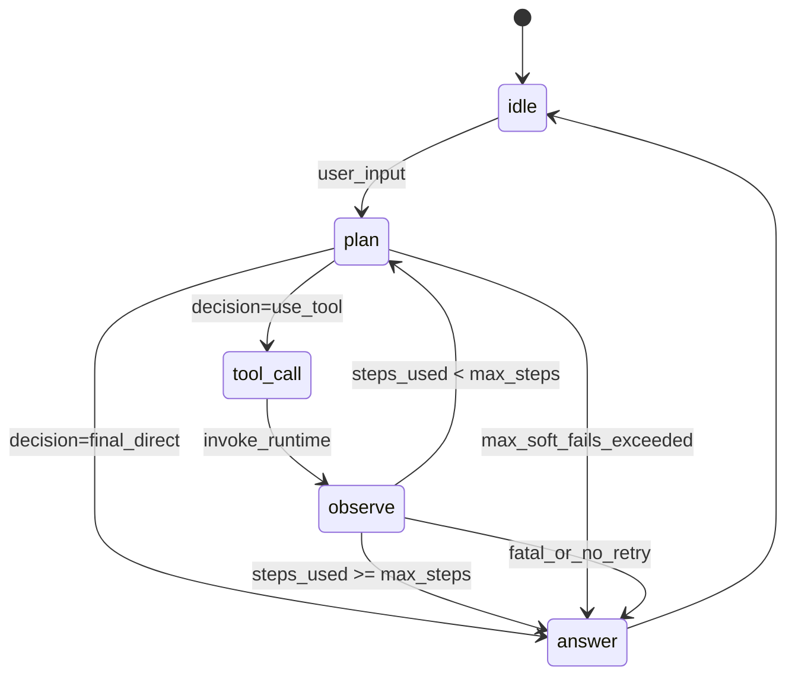

# Agent 行为设计：状态机、RAG 协作与 Prompt 分层

本文档描述 **Agent 循环** 的行为契约与设计意图，供实现与协调对齐。不涉及具体 LLM 提供商、HTTP 路径或 SDK 细节；仅抽象接口与字段约定。

---

## 1. Agent 状态机

### 1.1 主流程（成功路径）

```text
idle → plan → tool_call → observe → plan → … → answer → idle
```

- **idle**：无进行中的 turn；等待用户输入。
- **plan**：根据当前目标、历史与可选上下文，决定下一步是「调用工具」还是「直接产出最终答案」。
- **tool_call**：向运行时发出**单次**结构化工具调用请求（见 §4）。
- **observe**：将工具执行结果（成功或失败）写入对话轨迹，供下一轮 plan 使用。
- **answer**：产出对用户的最终自然语言回复；本轮结束，回到 **idle**（或等价地结束 session turn）。

### 1.2 失败与边界分支

| 分支 | 条件 | 行为 |
|------|------|------|
| **plan 非法输出** | planner 未产出合法「计划结构」或 JSON 无法解析 | 记一次 **soft_fail**；向 observe 注入标准化错误摘要；若未超 `max_soft_fails` 则回到 **plan**，否则 **answer** 简短说明并结束 |
| **tool 不存在** | 工具名不在注册表 | observe 回灌 `TOOL_NOT_FOUND`；回到 **plan** |
| **tool 执行异常** | 工具抛错或超时 | observe 回灌 `TOOL_EXEC_ERROR`（含可读 message）；按 §4 重试策略决定是否 **plan** 重试或 **answer** 降级 |
| **达到最大步数** | `steps_used >= max_steps` | 强制进入 **answer**：说明已达步数上限，建议简化问题；结束 |
| **用户中止** | 外部取消 | 进入 **idle** 或 **answer**「已取消」（产品可选） |

### 1.3 最大步数

- **max_steps**：单次用户 turn 内，**plan → (tool_call → observe)\*** 循环的上限（不含最终 **answer** 本身占用的步数计数方式由实现约定，建议：`tool_call` 每次 +1，`answer` 不计入或计 1 次需在全仓统一）。
- 达到上限时**不得**再发起 tool_call，必须 **answer**。

### 1.4 Mermaid 状态图



---

## 2. 与 RAG 的协作策略

### 2.1 设计原则

- **RAG 负责**：基于已入库语料的检索 → 重排 → **证据约束生成**（含引用与拒答 reason）。
- **Agent 负责**：多步推理、工具、记忆/技能、以及**在 RAG 不足时的兜底话术**（不伪造语料内不存在的事实）。
- **禁止**：用工具「假装再检索一遍」替代已由编排层注入的同一批证据（除非用户明确要求查 workspace 文件等工具职责内行为）。

### 2.2 决策表（何时 RAG / 直答 / 拒答）

| 场景 | 条件（抽象） | 路由 | 说明 |
|------|----------------|------|------|
| A | 配置开启 RAG，且本轮被判定为**知识型事实问答**（依赖语料） | **先 RAG** | 编排层调用 `RAG.answer(question)`；将 `retrieval_hits` + 结构化结果注入后续上下文 |
| B | RAG 返回 `refusal=false` 且 reason 为空或业务认可 | **优先采用 RAG 答案** 作为最终回复（或作为 `final-answer` 的强约束输入） | 避免 chat 模型覆盖已 grounded 结论 |
| C | RAG 返回 `refusal=true`，`reason=no_retrieval_hit` | **Agent 可直答或拒答**：说明无检索命中；**不得**编造数值 | 若需外部数据，仅能通过允许的工具（若存在） |
| D | RAG 返回 `refusal=true`，`reason=insufficient_evidence` | **拒答或极短降级**（说明证据不足），或进入 **plan** 看是否有工具可补充（仅限工具能力范围内） | 不把「猜测」包装成语料事实 |
| E | 本轮为**纯工具型**（算时间、读文件、改记忆） | **可不调用 RAG** | `plan` 直接 tool_call |
| F | 本轮为**闲聊/格式转换**且明确不涉及语料事实 | **直答** | 不强制 RAG |
| G | 用户同时需要 RAG 与工具 | **RAG 先**（若 A 成立），再在 **plan** 中编排工具 | 工具结果进入 **observe** |

### 2.3 伪代码级编排（抽象）

```text
function handle_turn(user_message, config, history):
    rag_result = null
    if config.rag_enabled and classify_as_knowledge_intent(user_message):
        rag_result = RAG.answer(user_message)

    if rag_result != null and rag_result.refusal == false:
        return finalize_from_rag(rag_result)   # 或注入 final-answer，禁止覆盖事实结论

    augmented_input = user_message
    if rag_result != null and has_hits(rag_result):
        augmented_input = inject_evidence_block(user_message, rag_result.retrieval_hits)

    return run_state_machine(
        state=idle,
        user_input=augmented_input,
        rag_meta=rag_result,   # 供 planner 只读：refusal/reason/citations
        max_steps=config.max_steps
    )
```

---

## 3. Prompt 分层设计

各层可映射为不同 system 片段或独立消息角色；实现可合并，但**职责不得混用**。

### 3.1 System（全局）

| 职责 | 输入（抽象） | 输出 |
|------|----------------|------|
| 身份与安全边界、语言、禁止项 | `locale`, `policy_version` | 无独立结构化输出；约束后续所有层 |
| 与 RAG 分工 | 静态说明：工具不用来替代已注入证据的检索 | 无 |

### 3.2 Planner（计划层）

| 职责 | 输入字段（抽象） | 输出字段（抽象） |
|------|------------------|------------------|
| 决定下一步：工具 vs 终答 | `user_goal`, `history_summary`, `rag_meta?`（refusal/reason/hit_count）, `available_tools[]` | `decision`: `use_tool` \| `final_direct` |
| | | 若 `use_tool`：`tool_name`, `tool_input`, `rationale_short` |
| | | 若 `final_direct`：`answer_outline` 或交给 final-answer 层 |

### 3.3 Tool-use（工具调用层）

| 职责 | 输入字段 | 输出字段 |
|------|----------|----------|
| 仅当 `decision=use_tool` 时激活 | `tool_name`, `tool_schema_hint`, `tool_input_draft` | **严格**符合 §4 的 JSON（仅此一段，无自然语言前缀） |

### 3.4 Final-answer（终答层）

| 职责 | 输入字段 | 输出字段 |
|------|----------|----------|
| 对用户可读终答 | `user_message`, `history`, `tool_traces[]`, `rag_answer?`, `rag_refusal?` | 自然语言；若业务要求结构化（如结论/依据/引用），在此层统一格式 |
| 与 RAG 一致 | 若已采用 RAG 成功结果，本层可为 **no-op** 或仅做轻度润色（不改变事实与引用） | |

---

## 4. 工具调用协议（规范）

### 4.1 单次 tool 调用的 JSON 形状（抽象）

```json
{
  "tool": "<registered_tool_name>",
  "input": "<string, 工具约定格式>"
}
```

- **约束**：整段响应**仅为**上述 JSON 对象（或可解析的等价形式），无前后缀自然语言。
- **扩展**（可选，需全仓统一后再用）：`"id": "call_1"` 用于并行或追踪。

### 4.2 错误回灌格式（写入 observe）

统一为一条**用户侧或 system 侧**可解析的文本块，建议：

```text
[TOOL_RESULT]
status: ok | error
tool: <name>
message: <human_readable>
payload: <optional_string_or_json_string>
[/TOOL_RESULT]
```

- **status=ok**：`payload` 为工具返回值摘要或全文（由工具定义上限）。
- **status=error**：`message` 必含原因枚举 + 简短说明，例如：
  - `TOOL_NOT_FOUND`
  - `TOOL_VALIDATION_ERROR`
  - `TOOL_TIMEOUT`
  - `TOOL_EXEC_ERROR`

### 4.3 重试策略（文字规范）

| 错误类型 | 是否自动重试 | 规则 |
|----------|----------------|------|
| `TOOL_NOT_FOUND` | 否 | planner 必须改选工具或终答说明 |
| `TOOL_VALIDATION_ERROR` | 至多 1 次 | 同一 `tool` 仅允许**一次**自动重试；重试前 planner 须修正 `input` |
| `TOOL_TIMEOUT` | 至多 1 次 |  backoff 由实现定义；第二次失败则终答降级 |
| `TOOL_EXEC_ERROR` | 否（除非工具文档明确可重试） | 进入 plan 判断是否换工具或终答 |

- **全局**：同一 `tool` + 相同 `input` 在连续两轮内重复失败 → **禁止**第三次相同调用，必须换策略或终答。

---

## 5. 与现有仓库的对应关系（非实现）

| 概念 | 建议落地位置（实现阶段） |
|------|---------------------------|
| 状态机循环 | `agent_loop.py` 或等价 orchestrator |
| RAG 编排与注入 | `rag_agent_service` + `agent_service.chat` |
| 证据格式与引用 | `evidence_format.py` + `generation.py` |
| 工具注册 | `tools/registry.py` |
| 任务理解 / 澄清 / 意图 + 显式规划 | 见 [dialogue-planning.md](dialogue-planning.md) |

---

## 6. 变更门禁

若未来增加对外字段（如 `selected_evidence_ids`）或改变 `/api/chat` 响应形状，须先更新 [coordination.md](../coordination.md) 对应章节，再改实现。
